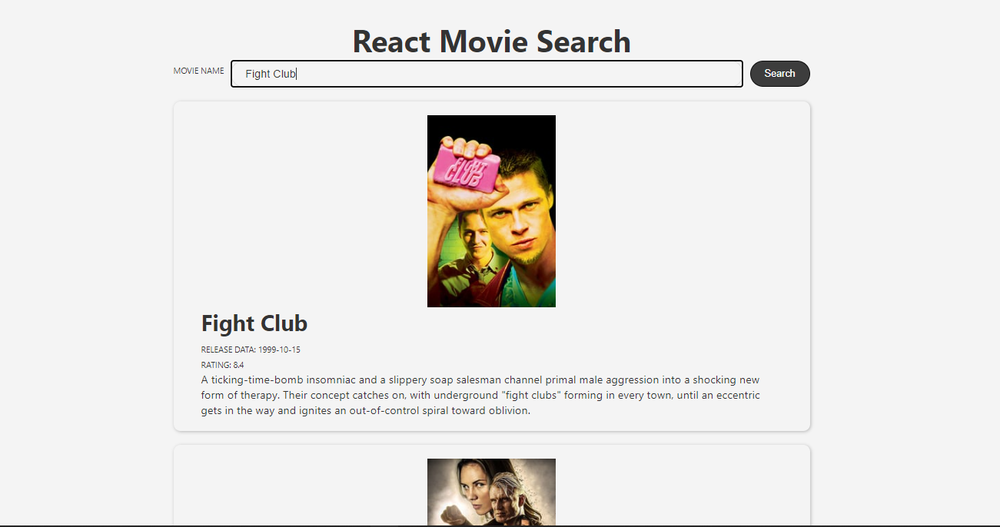

### React Movie App

#### What is this ?
 This is a simple learning application  built to search movies using a [themovedb.org](https://www.themoviedb.org)API.
 
 ### What does it look like ?
 
 
 ### What did I learn ?
 1.  Learnt about components, states and React Hooks.
 2.  Created new components and interacted with them.
